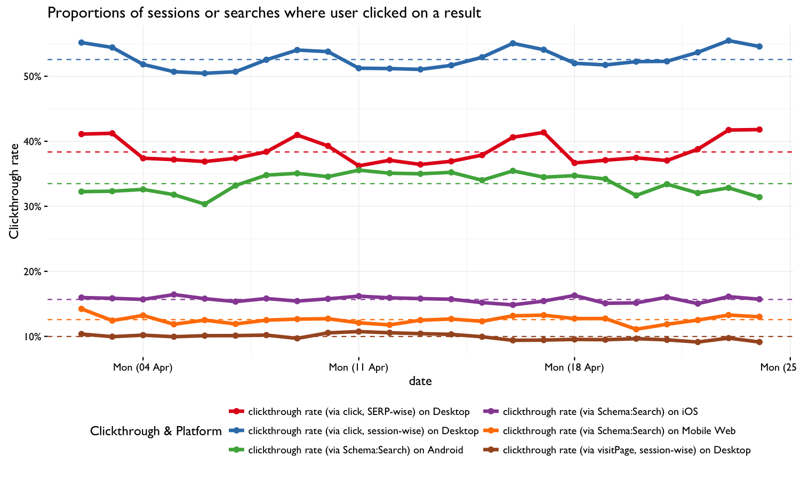

```{r setup, include = FALSE}
knitr::opts_chunk$set(echo = FALSE, message = FALSE, warning = FALSE)
```

\renewcommand{\abstractname}{Executive Summary}
\begin{abstract}
...
\end{abstract}

...stuff about interwiki and event logging not working so we can't get visitPage events and need to check if we can rely on click events before we use that schema for the [TextCat A/B test](https://phabricator.wikimedia.org/T121542)...



\newpage

\begin{landscape}

\begin{table}[h]
\sffamily
\caption{...}
\centering
\renewcommand{\arraystretch}{2.0}% for the vertical padding
\begin{tabular}[t]{l|r}
\hline
 ~ & \textbf{Proportion of sessions}\\

\end{tabular}
\end{table}

\end{landscape}
