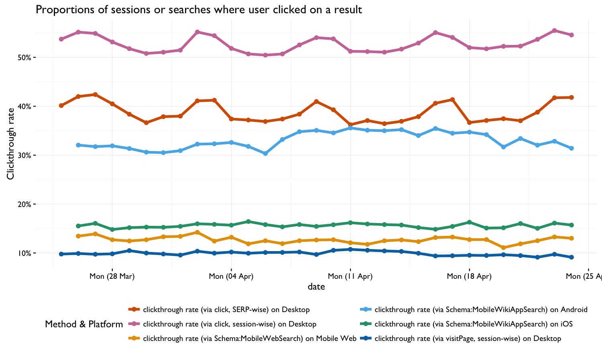

```{r setup, include = FALSE}
knitr::opts_chunk$set(echo = FALSE, message = FALSE, warning = FALSE)
```

\renewcommand{\abstractname}{Executive Summary}
\begin{abstract}
...
\end{abstract}

...stuff about interwiki and event logging not working so we can't get visitPage events and need to check if we can rely on click events before we use that schema for the [TextCat A/B test](https://phabricator.wikimedia.org/T121542)...



\newpage

\begin{landscape}

\begin{table}[h]
\sffamily
\caption{...}
\centering
\renewcommand{\arraystretch}{2.0}% for the vertical padding
\begin{tabular}[t]{l|r}
\hline
 ~ & \textbf{Proportion of sessions}\\
\hline
sessions with valid clicks only & 89.235\%\\
\hline
sessions with valid visits only & 16.849\%\\
\hline
sessions with valid clicks AND visits & 14.327\%\\
\hline
sessions with more valid clicks than valid visits & 78.398\%\\
\hline
sessions with more valid visits than valid clicks & 3.371\%\\
\hline
sessions with valid clicks AND visits, AND clicks match visits 100\% & 8.971\%\\
\hline
sessions with valid clicks AND visits, AND clicks don't match visits at all & 0.756\%\\
\hline
sessions with clicks but not valid clicks & 8.883\%\\
\hline
sessions with visits but not valid visits & 0.000\%\\
\hline
sessions with valid clicks that couldn't be matched with valid visits & 4.668\%\\
\hline
sessions with valid visits that couldn't be matched with valid clicks & 2.752\%\\
\hline
\end{tabular}
\end{table}

\end{landscape}
